# Examples of drawings and graphs made in TikZ 

To convert all the pdf files into png images one shall run the command 

``for d in *.pdf; do pdftoppm $d ${d%.*} -png; done``

### [algebra_invariance_2.tex](algebra_invariance_2.tex)

### [algebra_invariance.tex](algebra_invariance.tex)

### [block_contributions.tex](block_contributions.tex)

### [block_figure.tex](block_figure.tex)

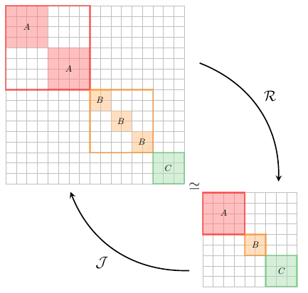

### [central_spin_block_reduced.tex](central_spin_block_reduced.tex)

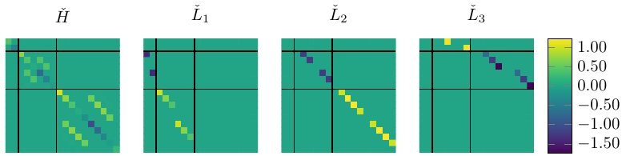

### [central_spin_blocks.tex](central_spin_blocks.tex)

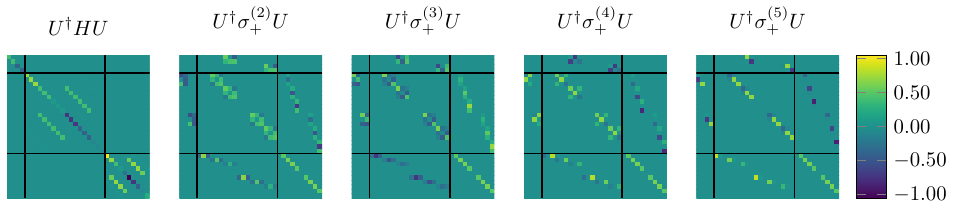

### [central_spin_dimensions.tex](central_spin_dimensions.tex)

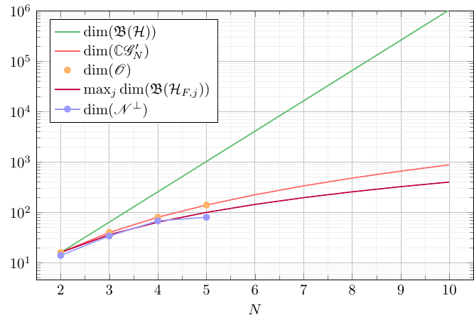

### [central_spin_figure.tex](central_spin_figure.tex)

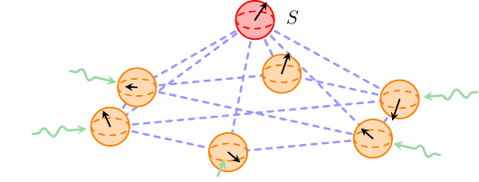

### [central_spin_ising_entropy.tex](central_spin_ising_entropy.tex)

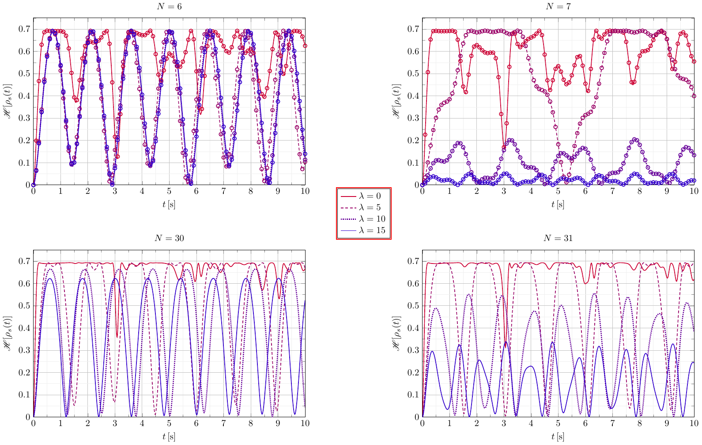

### [central_spin_ising.tex](central_spin_ising.tex)

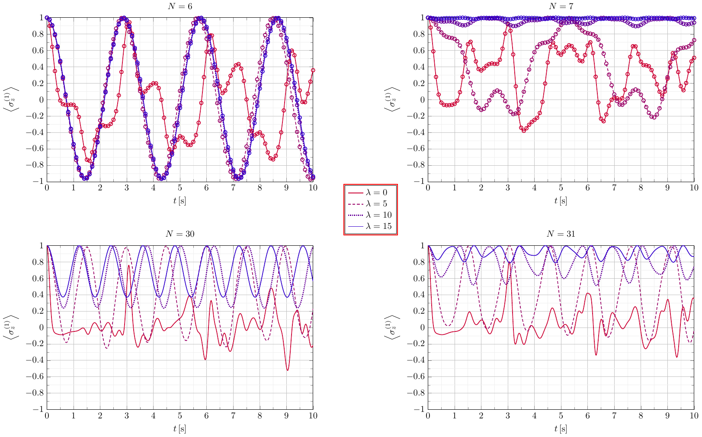

### [collectiive_blocks.tex](collectiive_blocks.tex)

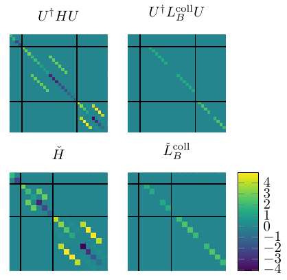

### [collective.tex](collective.tex)

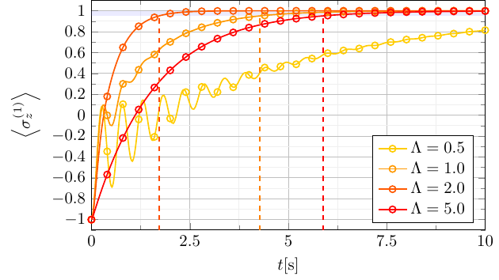

### [diagonals.tex](diagonals.tex)

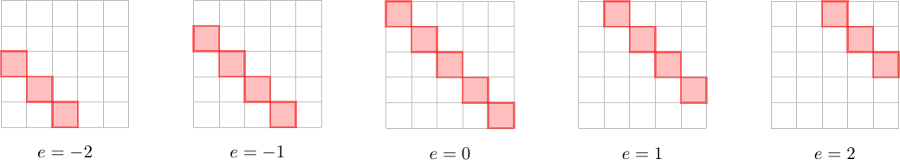

### [encoding_1.tex](encoding_1.tex)

### [encoding_2.tex](encoding_2.tex)

### [encoding_3.tex](encoding_3.tex)

### [encoding_4.tex](encoding_4.tex)

### [encoding_5.tex](encoding_5.tex)

### [encoding_6.tex](encoding_6.tex)

### [reachable_dimensions.tex](reachable_dimensions.tex)

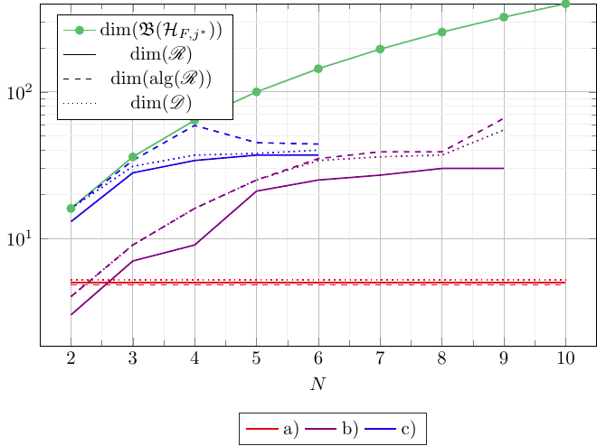

### [setling_time.tex](setling_time.tex)

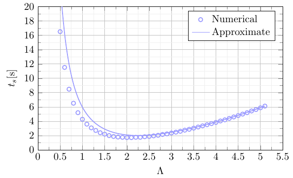

### [spin_grid.tex](spin_grid.tex)

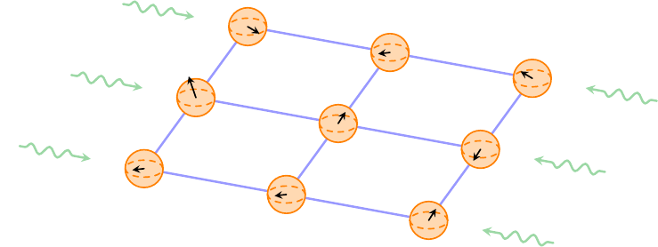

### [xxz_blocks.tex](xxz_blocks.tex)

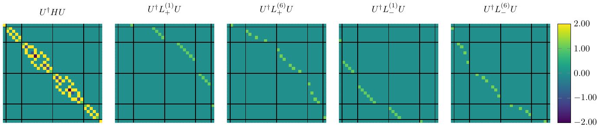

### [xxz_currents.tex](xxz_currents.tex)

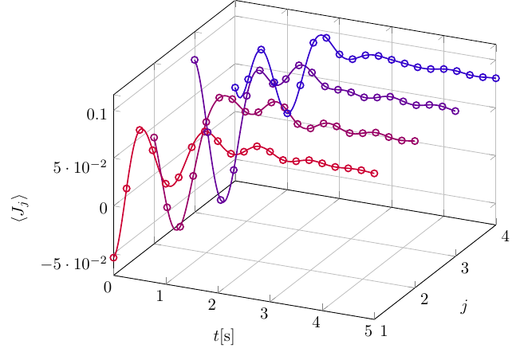

### [xxz_dimensions.tex](xxz_dimensions.tex)

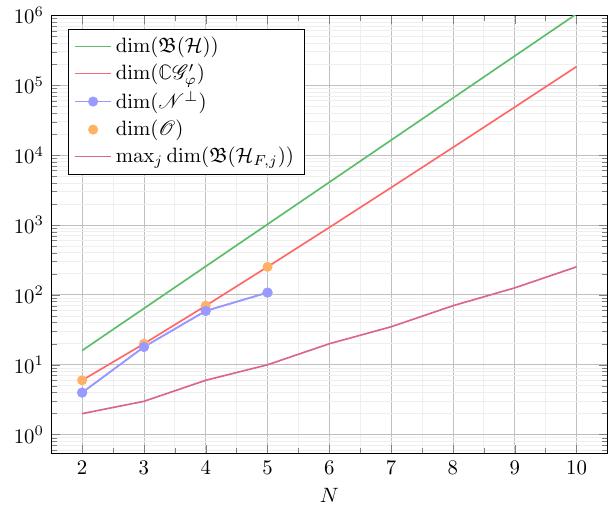

### [xxz_drawing.tex](xxz_drawing.tex)

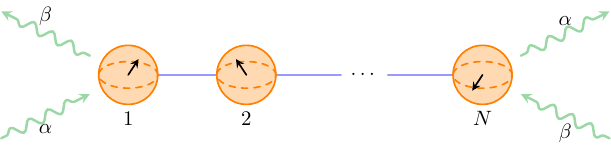

### [xxz_magnetization.tex](xxz_magnetization.tex)

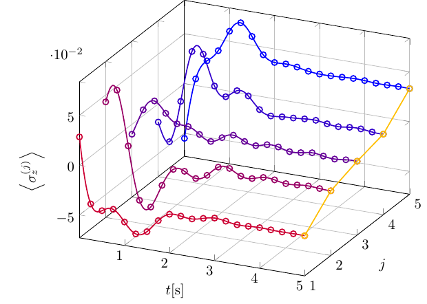
